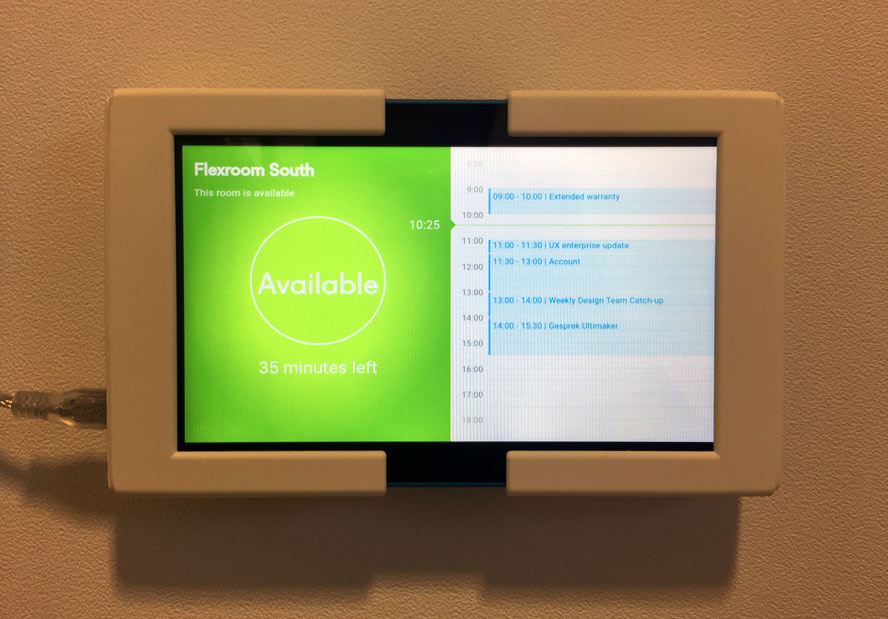

# Ultimaker meeting room display

We ([@jankeesvw](https://github.com/jankeesvw), [@davycardinaal](https://github.com/davycardinaal) and 
[@rowanzajkowski](https://github.com/rowanzajkowski)) created this project as part of our research sprint in december 2016.

We wanted to build a small app to prevent the interruption of meetings, you hear these questions a lot:

* Did you book this room?
* When are you leaving this room?
 
## What is this?
 
 This repository contains a Rails application that can display the current occupation of a meeting room. 
 It's connected to the Google Calendar and can be connected via OAuth in use it looks like this:
 

## FAQ:

Q: The list does not show the calendars of meeting room X
> A: We use a personal Google Account to access the data of the calendars, we ask Google for the calendars that our user can see. We only get the calendars our user has in the sidebar, so make sure all the meeting rooms are visible in the sidebar of [https://calendar.google.com](calendar.google.com). 

> The credentials get stored in the Redis and you can sign out by visiting `oauth/sign_out`.

Q: How is this hosted?
> A: We are currently hosting this project on Heroku, which is free (for our limited use). To run the application you need two environment variables: `BASIC_AUTH_USER_NAME` and `BASIC_AUTH_PASSWORD`.

Q: What technology is used?
> * [Ruby 2.3.1](https://www.ruby-lang.org/) 
> * [Ruby Rails](https://github.com/rails/rails)
> * [Redis](https://redis.io/)
> * [Google Auth Library for Ruby](https://github.com/google/google-auth-library-ruby)

Q: What tablet did you use?
> A: We bought the cheapest Android tablet we could find: [Lenovo Tab 3 7 Essential 8 GB at Coolblue (€79,00)](http://www.tabletcenter.nl/product/703462/category-193340/lenovo-tab-3-7-essential-8-gb.html)

Q: Can you make feature X?
> A: We would love to make this application better, if you have any ideas please open an issue.

Q: I've found a bug.
> A: We would love to make this application better, if you found a bug please open an issue.
